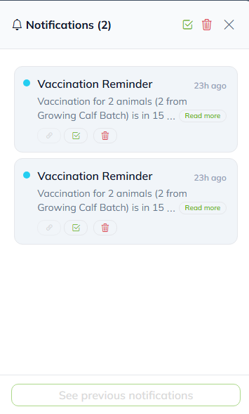

# NH Notification Package

**Version:** 1.8.6  
**Author:** [Nazmul Hasan](mailto:nazmulhasan169369@gmail.com)  
**License:** MIT  
**Framework:** Laravel 10 / 11  
**PHP:** >= 8.1

---

## 🧩 Overview

A modern Laravel package for sending **SMS**, **Email**, and **Push** notifications seamlessly across your application.  
Easily queue and localize notifications with one unified interface.

---

## ⚙️ Installation

### 🪄 Step 1: Install Package

```bash
composer require nht/notification
```

### ⚙️ Step 2: Enable Queues

Edit your `.env` file:

```ini
QUEUE_CONNECTION=database
```

Then create queue tables:

```bash
php artisan queue:table
php artisan queue:failed-table
php artisan migrate
```

### ⚡ Step 3: Publish Configurations

```bash
php artisan nht-notification:published
```

---

## 🧠 Import Class

```php
use NH\Notification\Notifications\Notification;
```

You can now send **SMS**, **Email**, or **Push** notifications — separately or together.

---

## 📱 SMS Notifications

### ✉️ Option 1 — Using `Notification::send()`

```php
Notification::send([
    'sms' => [
        'phone' => '+60135871622',
        // 'sms_to_users' => $users, // Optional: send to a specific user
        'message' => 'Write message here...',
    ],
]);
```

### 💬 Option 2 — Using `Notification::sendSms()`

```php
Notification::sendSms([
    'phone' => '+18777804236',
    'message' => 'Write message here...',
]);
```

---

## 📧 Email Notifications

```php
$users = \App\Models\User::all();
```

### 🧰 Option 1 — Template Email

To define the base view path, add to your `.env` file:

```ini
MAIL_TEMPLATE_PATH=emails
```

```php
Notification::sendMailWithTemplate([
    'template' => ['withdrawal notification', 'Subject'], // ['view', 'subject key']
    'subject' => 'Withdrawal Request',
    'mail_to_users' => $users,
    'data' => [
        'user_name' => 'Anik Da',
        'amount' => 1000,
        'submitted_by' => 'Lukmanul Hakim Hasibuan',
        'status' => 'Pending',
        'transaction_view_on' => route('customer.product'),
    ],
]);
```

### 📩 Option 2 — Registration Notification

```php
Notification::send([
    'mail-template' => [
        'template' => ['registration', 'Subject'],
        'subject' => 'Welcome to ALJ Harmony',
        'mail_to' => 'email@email.com', // or ['email1', 'email2']
        'mail_to_users' => $users,
        'data' => (object)[
            'user_name' => 'Anik Da',
            'role' => 'Agency Admin',
            'agency_name' => 'ALJ Harmony',
            'email' => 'example@email.com',
            'login_on' => route('customer.product'),
        ],
    ]
]);
```

### 🛠️ Option 3 — Custom Email View

```php
Notification::send([
    'mail' => [
        'mail_to' => 'email@email.com',
        'mail_to_users' => $users,
        'subject' => 'Email Subject',
        'view' => 'applications.agents.emails.withdrawal-notification',
        'data' => (object)[
            'user_name' => 'Anik Da',
            'amount' => 1000,
            'submitted_by' => 'Lukmanul Hakim Hasibuan',
            'status' => 'Pending',
            'transaction_view_on' => route('customer.product'),
        ],
    ]
]);
```

### ✨ Option 4 — Using `sendMail()` Helper

```php
Notification::sendMail([
    'mail_to' => 'email@email.com',
    'mail_to_users' => $users,
    'subject' => 'Withdrawal Notification',
    'view' => 'applications.agents.emails.withdrawal-notification',
    'data' => (object)[
        'user_name' => 'Anik Da',
        'amount' => 1000,
        'submitted_by' => 'Lukmanul Hakim Hasibuan',
        'status' => 'Pending',
        'transaction_view_on' => route('customer.product'),
    ],
]);
```

---

## 🔔 Push Notifications

### 🗄️ Step 1: Setup Database

```bash
php artisan notifications:table
php artisan migrate
```

### 🚀 Option 1 — Using `Notification::send()`

```php
Notification::send([
    'push' => [
        'sent_to_users' => $users,
        'data' => [
            'booking_id' => 1,
            'message' => 'Your booking has been confirmed.',
        ],
    ]
]);
```

### 🚀 Option 2 — Using `Notification::sendPush()`

```php
Notification::sendPush([
    'sent_to_users' => $users,
    'data' => [
        'booking_id' => 1,
        'message' => 'Your booking has been confirmed.',
    ],
]);
```

## Push Notification Drawer

### 1. Overview

The **Push Notification Drawer** is a slide-in panel that shows all recent notifications for the logged-in user.

- Opens from the **right side** of the screen.
- Can be toggled from the **notification bell icon** in the top bar.
- Shows **unread** and **read** notifications, grouped by time.
- Supports **click actions** (e.g., open related page, mark as read, etc.).

---

### 2. Demo Page URL

You can view the demo page here:

👉 **URL:** https://your-domain.com/nht-notifications  
(Replace this with your actual domain name)

Example placeholder:

### Header menu bell icon


### Sidebar notification drawer


### 2.1 Closed State (Bell Icon with Badge) 

```text
Top Navigation Bar
┌─────────────────────────────────────────────────────────┐
│  Logo         ...                         🔔 (3)       │
└─────────────────────────────────────────────────────────┘
```

---

## 🌍 Localization Support

Enable localized messages in `.env`:

```ini
MAIL_SUBJECT_LOCALIZE=true
```

Create translation files:

```bash
resources/lang/en/notification.php
resources/lang/en/account_registration.php
```

Example:

```php
Notification::send([
    'mail-template' => [
        'template' => ['registration', 'Subject'],
        ...
    ]
]);

return [
    'registration' => 'Hello :cun, your account at :agn is ready. Login here: :url',
];
```

---

## 📨 Retrieve Notifications

```php
Notification::get();
```

---

## 🧹 Uninstall Package

To completely remove:

```bash
php artisan nht-notification:remove
// or
php artisan nht-notification:remove --force
```
and then
```bash
composer remove nht/notification
```

---

## 💡 Tips & Notes

- Ensure queue worker is running:
  ```bash
  php artisan queue:work
  ```
- `mail_to_users` accepts any `User` model collection.
- `phone` must follow **E.164** international format (`+60`, `+88`, etc.).
- You can combine SMS + Email + Push in a single call.
- Works perfectly with **queued notifications**.

---

## 🧬 Example: Combined Notification

```php
Notification::send([
    'sms' => [
        'phone' => '+60135871622',
        'message' => 'Account activated successfully.',
    ],
    'mail' => [
        'mail_to' => 'email@email.com',
        'subject' => 'Account Activated',
        'view' => 'emails.account-activated',
        'data' => (object)['user_name' => 'Lukmanul Hakim'],
    ],
    'push' => [
        'sent_to_users' => $users,
        'data' => [
            'title' => 'Welcome!',
            'message' => 'Your account is ready to use.',
        ],
    ],
]);
```

---

## 🛠️ Troubleshooting

| ⚠️ Issue | 💡 Fix |
|-----------|--------|
| Email not sending | Check `.env` mail configuration and queue connection |
| SMS not sending | Verify your SMS API credentials and gateway setup |
| Push not working | Ensure `notifications` table exists & `Notifiable` trait is used in `User` model |
| `route('login')` undefined | Ensure your `web.php` defines a named route for login |

---

## 🧭 License

Released under the **MIT License**.  
© 2025 [Nazmul Hasan](mailto:nazmulhasan169369@gmail.com)

---

🧡 Built with passion for modern Laravel development.
